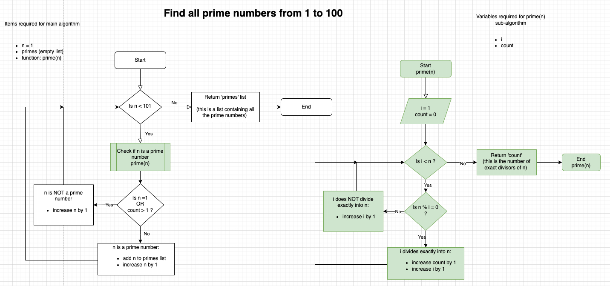

# Assignment 1

## Q1
Markup languages are a way of coding using symbols to control the stucture and content of a text document. They group commonly used features together so that they can all share a common format or functionality. 

They have several defined elements (for example H1, H2, etc which define certain header styles and will format them accordingly). These elements are commonly distinguished between the content by using symbols, such as `<>` or `#`. Rather than having a section of the document for markup definitions and a separate section for the content, markup languages often inter-mingle these so that the element is defined immediately followed by the content of that element.

Another common feature is the output follows the flow of the markup document, therefore the elements and content are entered in the order they should be displayed, which makes it simple to write and easy for others to understand.

Some elements are described as being "semantic". Examples of semantic elements are `h1` meaning "level 1 header', `p` meaning "paragraph" and `img` meaning "image". Semantic elements make it easy for users to write and understand the code because they describe the element's function.

>Citation: Markup language (2023) Wikipedia. Available at: https://en.wikipedia.org/wiki/Markup_language (Accessed: 21 September 2023). 
<br><br>
## Q2
**Packets**: In computer networking, packets are used to break large amounts of information being sent over a network into smaller pieces or "packets". The reason for this is that if information were sent as a whole, it would slow the network down significantly. By using this system, individual packets are sent separately, each being routed to their destination by various routers and switches. When the packets arrive at their destination, they are re-assembled by the receiving computer to be displayed on screen or used for the intended purpose. [^1] 


**IP addresses (IPv4 and IPv6)**:
IP addresses were created to provide an address for any device or domain that is connected to a computer network. It serves as that device's address on the internet. IP version 4 (IPv4) was the original format used for IP addresses. IPv4 provides addresses as a 32-bit number in the format of 4 fields, each separated by a dot (.). IPv4 example: 198.35.26.96

As the internet grew, the number of available addresses in IPv4 became limited, so Ipv6 (IP Version 6) came into effect. These addresses are in hexadecimal format of 128 bits, comprising 8 fields separated by a colon (:). IPv6 example: 3002:0bd6:0000:0000:0000:ee00:0033:6778

The benefits of IPv6 compared with IPv4 are:

1. Providing vastly more available addresses
1. Providing integrated security measures meaning IPv6 addresses are less susceptible to attacks. [^2]


**Routers and routing**: Routers are devices that 'route' packets from one place to another. There are home routers which receive data via a modem and then 'forward' it onto a device (computer, phone, television etc) that is connected to the network, and has requested the data. This process exists on a larger scale over the internet enabling data packets to be transferred from one router to another until reaching its intended destination. Each packet has information contained within it specifying its destination. Routers use routing tables to determine the best route, similar to physical route planning in a car using maps and the road network. It might be that the shortest route is impacted by a traffic jam; a router will look for a diversion, which may be a longer route but will ultimately be more efficient than the impacted usual route.

When a router receives a packet, it reads the header which has information about its destination (including the destination IP address) and searches through routing tables to find an IP address which matches as closely as possible. It may also check for other information, indicating priority etc - but importantly, the router is not concerned with the actual contents of the packet nor where it came from. It does have a responsibility to determine which types of data need to be forwarded first (similar to express post packages being sent before standard post).

Routers can be set up with static routing tables, which means that until a network administrator updates them, they will always forward packets in accordance with the routing table.

There are also routing tables which are able to gather data from other routers and dynamically update their routes to improve efficiency and traffic speed.

Routers have a programmed default route which is an instruction on where to send packets with IP addresses not included in their routing table. It is possible for routers that are programmed to dynamically update their routes, to update the default route if necessary, otherwise it relies on a static default route. [^3]


**Domains and DNS**: Domains are the addresses of web pages, and they allow web browsers to locate the information being requested. In their original form, they are a collection of numbers which are interpreted by computers. In order to make this easier for humans, the Domain Name System (DNS) was introduced. This provides a human-friendly name which corresponds to each web page, meaning users are able to enter [www.google.com](https://www.google.com) into their browser's address bar, instead of needing to know the Google page's domain address. When a user types a domain name into the address bar, a process is carried out to link the domain name to the corresponding domain.

This system was instumental in enabling the internet to become widely used by non-technical people. A user friendly method to easily access web pages on the Internet was needed to make the Internet what it is today. [^4]

> Citations:
>
> [^1] (No date a) How does the internet work? |Packets | cloudflare. Available at: https://www.cloudflare.com/learning/network-layer/how-does-the-internet-work/ (Accessed: 18 September 2023). 
>
> [^2] Simplilearn (2023) What is an IP address - an ultimate guide, Simplilearn.com. Available at: https://www.simplilearn.com/tutorials/cyber-security-tutorial/what-is-an-ip-address (Accessed: 09 October 2023). 
>
> [^3] Router (computing) (2023) Wikipedia. Available at: https://en.wikipedia.org/wiki/Router_(computing) (Accessed: 21 September 2023). 
>
> [^4] (No date a) What is a domain name? | domain name vs. URL | cloudflare. Available at: https://www.cloudflare.com/learning/dns/glossary/what-is-a-domain-name/ (Accessed: 23 September 2023). 
<br><br>
## Q3
**TCP**: Transmission Control Protocol (TCP) is a secuity measure used when sending and receiving data via the internet. As discussed in the previous answer, when data is requested, it is broken down into smaller pieces called packets. These packets are first encrypted and then each is routed separately to the requesting device. Internet Protocol is responsible for the process of sending the packets, but TCP is needed to de-crypt them when they arrive, so that (in the case of a web page) the jumbled code is converted into an HTML file which can be interpreted by the web browser. [^1]


**HTTP and HTTPS**: Hypertext Transfer Protocol (HTTP) is a fundamental part and underpins everything related to the Internet. The 'protocol' part of this is related to a multi-layered system of protocols that are required to send and receive information via the Internet. This protocol exists at the 'application level', which means that HTTP requests, once received by the computer or device, are interpreted directly by the application. One of the problems with HTTP is that information sent in its raw form can be intercepted and misused by third parties who may be on the same network, or connected to the same public WIFI. To combat this, HTTPS (Hypertext Transfer Protocol Secure) was developed to encrypt the information. This is particularly necessary for banking and when inputting sensitive information into web applications. [^2]


**Web browsers (requests, rendering and developer tools)**: A web browser is an application that allows users to view, download and interact with content that is stored on the world wide web. When a user makes a request (types in the address or clicks a hyperlink to a page on the internet), the browser makes a HTTP request (or HTTPS if the browser is set in secure mode). Once the process of locating the IP address of the server storing requested information, the transmission protocols and the transfer of the data packets has taken place, the browser will receive the data (HTML, CSS, JavaScript files) needed to render the webpage.

Widely used browsers such as Google Chrome, Microsoft Edge and Safari have built in developer tools which enable web developers to view and troubleshoot web content directly in the browser. This has the benefit of allowing real-time inspection of the elements, their positioning and responsiveness and the ability to make adjustments and immediately see the results. [^3] & [^4]


> Citations:
>
> [^1] (No date a) What is TCP/IP? | cloudflare. Available at: https://www.cloudflare.com/learning/ddos/glossary/tcp-ip/ (Accessed: 23 September 2023). 
>
> [^2] (No date a) What is a protocol? | network protocol definition | cloudflare. Available at: https://www.cloudflare.com/learning/network-layer/what-is-a-protocol/ (Accessed: 23 September 2023). 
>
> [^3] Web browser (2023) Wikipedia. Available at: https://en.wikipedia.org/wiki/Web_browser (Accessed: 24 September 2023). 
>
> [^4] Web development tools (2023) Wikipedia. Available at: https://en.wikipedia.org/wiki/Web_development_tools (Accessed: 24 September 2023). 


<br><br>
## Q4

**1 - LISTS**

Lists are used to store objects of a particular data type. A list is a convenient way to store many individual objects that have some commonality instead of those objects being stored in separate variables. An example might be a list of children in a particular class and the benefits of storing the names in a list structure are that Python provides built in functions for sorting and extracting particular elements. Also the entire list can be searched for particular terms. Lists are 'mutable' meaning they can be changed after being instansiated; items can be added, removed, copied etc.

Note - lists allow duplicates, so if it is important to record how many times a particular name is referred to (for example in a vote count), then the list container should be used.

The syntax used to create lists is: `my_list = ["item1", "item2", "item 3"]`

[^1]

**2 - SETS**

A set is an unordered collection of objects which cannot contain duplicates and is immutable, meaning it cannot be changed once created. The caveat to this is that items can be removed and new items added in their place, but the length (`len()`) of the set will remain unchanged. Sets can be used for removing duplicates from a data set, or for storing usernames for an application, returning an error if a duplicate name is attempted to be added.

The syntax used to create sets is: `my_set = {"item1", "item2", "item 3"}`

[^2] & [^3] 


**3 - TUPLE**

A tuple allows the storing of multiple elements of varying data types in one object. Tuples can be used to store several items of personal information, e.g. employee data such as ID number, first name, last name, date of birth, job title. Another example is in data analytics where each tuple could be used a reference point for a particular data point (date, time, temperature, humidity, weather condition). Tuples are immutable, meaning once created they cannot be changed. They allow duplicates.

The following are examples of tuples: 
```
tuple_1 = ("Kelly", "planner", "0", "true")
tuple_2 = ("Marie", "customer service", "2", "false")
tuple_3 = ("Matthew", "recruitment", "1", "true")
```

[^4] & [^5]


> Citations:
>
> [^1] Built-in types (no date) Python documentation. Available at: https://docs.python.org/3/library/stdtypes.html (Accessed: 08 October 2023). Lists are mutable sequences, typically used to store collections of homogeneous items (where the precise degree of similarity will vary by application).
>
> [^2] Built-in types (no date a) Python documentation. Available at: https://docs.python.org/3/library/stdtypes.html#set-types-set-frozenset (Accessed: 08 October 2023).
>
> [^3] (No date a) Python sets. Available at: https://www.w3schools.com/python/python_sets.asp (Accessed: 08 October 2023).
>
> [^4] Built-in types (no date a) Python documentation. Available at: https://docs.python.org/3/library/stdtypes.html#tuples (Accessed: 08 October 2023).
>
> [^5] (No date a) Python tuples. Available at: https://www.w3schools.com/python/python_tuples.asp (Accessed: 08 October 2023). 

<br><br>
## Q5
For a compiled language, when it is processed the entire program is "compiled" first then run. This means that the code is converted into "machine code" - this is a low-level programming language understood by the computer's CPU - then the program is run. The benefits of this are that compiled programs run quicker than interpreted ones because the code has already been converted before run time. The drawback however, is that they are written for specific hardware and operating systems, and so the programs are less portable from one system to another. Examples of compiled languages are Java, C++ and C#.

Interpreted languages are converted to machine code by an interpreter at run time. This means they are slower to process because the computer's CPU can only execute each line of code one by one as it is interpreted. Interpreted languages can be run directly from the command line and they have the advantage over compiled languages in that they can be easily executed on machines with different operating systems. Examples of interpreted languages are Python, JavaScript and PHP.

> Citation: Revinr (no date) What is the difference between a compiled and interpreted programming language?, LinkedIn. Available at: https://www.linkedin.com/pulse/what-difference-between-compiled-interpreted-programming-language (Accessed: 09 October 2023). 

<br><br>
## Q6
**1 - PYTHON**

Python is a very popular programming language due to its simple syntax and wide range of uses.

<u>Benefits</u> 
- Beginner-friendly: the simple syntax makes it an easy language for beginners to learn
- Object-oriented: object-oriented programming languages have fundamentally similar logic, making it easy for programmers who already know one object-oriented language to apply that knowledge to Python
- Portable: Python programs are portable across operating systems
- Dynamic typing: Python assigns the type of the variable based on the argument assigned to it, so there's no need for the programmer to specify this each time they create a variable
- Broad appeal: Python is widely used for a variety of industries and domains, including web applications, database access, data analysis, machine learning, game development and many more
- Open sourced: it is constantly evolving and being improved by a large community of developers from all around the world - anyone is able to access the source code and suggest updates or additions - this large community also fosters connections and means support is never far away
- Popular: developers with Python knowledge are widely sought after by tech companies

<u>Drawbacks</u> 
- Performance issues: the processing power required to dynamically assign the type of each variable and interpret each line of code at run time, can impact the performance of the computer if programs are large or complex
- Few 'rules': seemingly a positive, especially when it comes to learning the language, but also a negative in the sense of allowing some degree of freedom of expression - this flexibility can cause code to be difficult to read and understand
- Dynamic typing: it's not always clear what type a variable is - this can make it difficult to find errors in the code and can cause unexpected results


**2 - JAVA**

Java is also a popular programming language. It is more syntactically complex than Python, making it more difficult for beginners to learn

<u>Benefits</u> 
- Compiled language: Java code is converted into low-level machine code at compile time - this improves the speed of running the program
- Speed/performance: Java programs run quicker than some other languages which are interpreted
- Object-oriented: object-oriented programming languages have fundamentally similar logic, making it easy for programmers who already know one object-oriented language to apply that knowledge to Java
- Inheritance: Java makes use of inheritance, meaning code does not have to be re-written (or re-run by the computer) - instead it can use as much as possible from the parent class before reading code in the inherited class or interface
- Multi-threading: Java is able to run multiple parts, which are separated into different 'threads', of a program concurrently; this has the benefit of maximising the capability of the computer's CPU [^1]
- Portable: Java while being a compiled language, only needs to be compiled once, then it can be run on different operating systems which enables portability across a spectrum of devices
- Large community: there is a large community of developers an many forums and working groups can be found online, making it easy to find support and also make industry connections
- Popular: developers with Java knowledge are widely sought after by tech companies
- Security: Java has many in-built security features including access control, advanced authentication and cyptography, making it a go-to choice for financial companies [^2]


<u>Drawbacks</u> 
- Complicated syntax: Java has very precise syntax requirements: each line of code needs to end with a semi-colon and braces `{}` are used when definining functions, using control flow statements etc; omitting these will cause compilation errors
- Long lines of code: a line of code in Java can be 3-4 times longer than the same code written in a more simple language
- Type definition: each object must have its type explicitly defined when it is created
- Propriety software: Java is owned by Oracle and is not open-sourced - there is a system to allow user-based contribution via forums, but it is not as readily "community-developed" as other languages - this means improvements and updates are slower to occur [^3]


> Citation: Python language advantages and applications (2023) GeeksforGeeks. Available at: https://www.geeksforgeeks.org/python-language-advantages-applications/ (Accessed: 09 October 2023). 
>
> C++ vs Java vs python (2022) GeeksforGeeks. Available at: https://www.geeksforgeeks.org/c-vs-java-vs-python/ (Accessed: 09 October 2023). 
>
>[^1] Java cheat sheet (2023): Freshers and experienced (2023) GeeksforGeeks. Available at: https://www.geeksforgeeks.org/java-cheat-sheet/ (Accessed: 09 October 2023). Java Multithreading
>
>[^2] Griesser, C. (2022) Is python more secure than java?, SOOS. Available at: https://soos.io/is-python-more-secure-than-java (Accessed: 09 October 2023). Java vs. Python Security: Key Differences
>
>[^3] Java SE - Community (no date) Oracle. Available at: https://www.oracle.com/java/technologies/community-glance.html (Accessed: 09 October 2023). 

<br><br>
## Q7

**ISSUE 1: Access to a user's personal information**
IT professionals working in a position that allows them access to the personal information of colleagues or employees of their client are able to view and potentially misuse the information if they choose. Examples of misuse of this information include: 
- Spreading malicious or unkind information to others inside or outside the organisation 
- Using information to cause an employee to be disciplined or even terminated 
- Distributing personal information on social media or to traditional media outlets 
- Causing a data breach by selling data on the dark web 

‘Ethics’ is defined as “moral beliefs and rules about right and wrong”[^1] and can be something that varies from person to person. There are many instances where it is reasonable to expect people to react in a variety of ways when faced with the same set of circumstances, with their chosen path being very much dictated by their own moral code. However, there are also cases where a reasonable person would be *expected* to act in a certain way according to societal norms. In the example of a person working within an IT department, with the ability to access the personal data of colleagues, a person's response to this falls into the category of "what do their morals tell them to do?".

When there is a situation where the action of one party (the IT professional) is likely to cause harm to another party (their colleagues), then I believe that most people would agree the action to be unethical on the part of the IT professional. 

In Australia, there is no specific law covering data protection[^2], instead this is more generally covered by the Privacy Act (1988) and the Australian Privacy Principles (APP). This gives a list of recommendations for companies (such taking "reasonable steps to implement practices, procedures and systems that will ensure compliance with the APPs”). 

It’s also worth noting that, under the Privacy Act, private sector companies are specifically excluded from being required to follow the APPs (privacy principles) in relation to the handling of employee records.[^3] 

Due to this loose legal framework, there are effectively no legal rules to which private companies are required to adhere in relation to protecting the personal information of their employees. This is therefore very unhelpful in “assisting a developer to act in an ethical way”. However, as ethics encompasses not only what is legally right, but also helps to provide a set of principles about morals, there is no reason that private companies should not have their own code of conduct to inform all employees of their responsibilities and expectations.

**ISSUE 2: freedom of thought, conscience, speech and the media**
IT professionals should be empowered and have the freedom to express their thoughts and beliefs even if it is contrary to the beliefs of company management. Only when these issues are raised and discussed can they be addressed. This discussion can be a powerful tool for advancing ideas and innovations. 

The example of the Google employee, Timnit Gebru, who questioned the effectiveness of the large language models, being developed for use in Google’s AI technology before eventually being removed from the company, is a disappointing one. The employee, who is a black woman, was part of Google’s Ethical AI team, and felt a moral duty to highlight the flaws in the technology that frequently underperformed in its ability to recognise the faces of women of colour. [^4] 

In this case, the IT professional felt ethically responsible for a product being deployed with such flaws in place.  

The Australian laws pertaining to this are enacted at state or territory level. In Victoria, this is “The Right to Freedom of Expression” and is listed under Victorian Equal Opportunity and Human Rights Commission. The charter explains an individual’s right to form and express their own opinions and to express them freely, albeit with limitations in certain circumstances. [^5] 

In this case, the law is helpful in assisting an IT professional to act in an ethical manner. 

### CASE STUDY ON ISSUE 1
### "An inside threat: The Rotten Apple"
[Case Study - Personnel Security](https://ovic.vic.gov.au/information-security/risk-scenario-3-personnel-security-case-study/)

**Introduction**

I have reviewed a case study on unauthorised and unethical behaviour in a government department.

**What happened?**

The case study is about a security breach carried out by systems manager in which he was able to access the personal data of his colleagues, which he conveyed to “shady side parties”. It’s noted that this employee had a chequered employment history, having been terminated from a previous role for “unethical behaviour”. 

**How did it happen?**

There were several contributory factors, a kind of ‘perfect storm’ of circumstances that the perpetrator used to his advantage.  

Firstly, the department was under pressure to complete a project in a short time frame, and needing to hire additional staff to assist, the department was negligent in carrying out due diligence in the hiring process. The next issue was when setting up the new staff member’s access, as he was given much broader access that was necessary for his role. The staff member was also not adequately managed, there is a point noting “little oversight of his account”. The first colleague who thought there was suspicious activity did not report his concerns and even when the issue was internally investigated, it was never fully complete and he was allowed to stay on until the end of the project – potentially causing further risk. 

**Conclusions drawn in case study**

The recommendations given in the case study are: 

1) Robust screening process for new employees 
1) ‘Managing’ employees before, during and after employment 
1) Organisations to review, validate and update security policies and procedures 
1) Embed security requirements into HR/work management practices 

**My conclusions and recommendations**

As noted in the study’s conclusions, I think carefully screening applicants is incredibly important. Thorough reference checks should be obtained before engaging a new member of staff. Another increasing useful screening method is social media as this can provide a wealth of information about a person’s character. 

Departments like the one in the case study must have strong guidelines in place governing who needs what access and only provide the minimum required access. This means sensitive data is better protected and if there is an issue at any point, the source of the breach is easier to pinpoint. 

Compulsory risk and security training for all team members is also invaluable. Humans are frequently the weak link in an otherwise strong network of security defences, firewalls and multi-factor encryption. The more aware and prepared every member of staff is the more likely they are to respond appropriately when a security threat arises. 

Training on the policies and principles of accessing personal data for IT and HR team members would be highly beneficial in providing clear guidelines on what is and is not acceptable. 

Implementing and encouraging a whistleblower system so that team members understand and take seriously the need to keep themselves and the organisation for which they all work safe. Just like seeing something suspicious when out in a public place – the mantra is: “see something – say something”. The same should apply to a workplace. In this example, the activity could have been stopped sooner if the first person to have suspicions had spoken up. However, it’s worth noting that this can be a difficult thing in a workplace, with hierarchy, personal and professional relationships all having a factor – so I would recommend a phone number, email address, web form etc that people can contact anonymously to report concerns. 

Lastly, and crucially, any access tokens, VPN credentials, email and account access need to be disabled when employees leave the business, either temporarily or permanently. This applies to physical swipe cards or keys as well. This is mentioned in the case study (under managing separation from the organisation), but one further step could be setting automatic disabling of passwords after a set period of time. This would be another tool to mitigate against unauthorised users gaining access to the system, if they were mistakenly not de-activated at the time of leaving. 


> [^1] (No date a) Ethic definition and meaning | Collins english dictionary. Available at: https://www.collinsdictionary.com/dictionary/english/ethic (Accessed: 08 October 2023). 
> [^2] Australia - Data Protection Overview (2023) DataGuidance. Available at: https://www.dataguidance.com/notes/australia-data-protection-overview (Accessed: 08 October 2023). 
> [^3] Oaic (2023) Employment, OAIC. Available at: https://www.oaic.gov.au/privacy/your-privacy-rights/more-privacy-rights/employment (Accessed: 08 October 2023). 
> [^4] Simonite, T. (2021) What really happened when Google ousted Timnit Gebru, Wired. Available at: https://www.wired.com/story/google-timnit-gebru-ai-what-really-happened/ (Accessed: 08 October 2023). 
> [^5] Section 15 - your right to freedom of expression (no date) Victorian Equal Opportunity and Human Rights Commission. Available at: https://www.humanrights.vic.gov.au/for-individuals/right-to-freedom-of-expression/ (Accessed: 08 October 2023). 
> [^6] Risk scenario 3 - personnel security case study (2021) Office of the Victorian Information Commissioner. Available at: https://ovic.vic.gov.au/information-security/risk-scenario-3-personnel-security-case-study/ (Accessed: 08 October 2023). 
<br><br>
## Q8
Control flow is the process of allowing the program to follow different paths depending on various factors. Usually a program is not intended to run from start to finish executing every line of code. It's more likely that if one thing happens, then the program should do x and if another thing happens it should do y. Therefore programming languages have conditional statements e.g.: 
- if 
- then
- else if

There are also loops, which will execute one or more lines of code one or more times e.g.:
- do 
- while
- for

An example of control flow being implemented in Python is shown here:
```
def calc_frame (ball_1, ball_2, ball_3):
    if ball_1 == 10 or ball_1 + ball_2 == 10:
        score = ball_1 + ball_2 + ball_3
    else:
        score = ball_1 + ball_2
    return score
```
<br><br>
## Q9
Type coercion: Python automatically converts type e.g. int converted to float if it has an operation is performed that includes a float type (Implicit type assignment)

Example of type coercion:
```
a = 3       # 'a' is automatically assigned type 'int' 
b = 1.5     # 'b' is automatically assigned type 'float'
a = a + b   # when executing this line, Python will convert 
                'a' to type 'float' so that it can return 
                the answer of '4.5'
```

Type conversion: the user can expressly state the type required by including `str()`, `int()`, `float()` etc (Explicit type assignment)

Example of type conversion:
```
age = int(input())  
# the variable `age` would have been automatically assigned 
'str', but it has been explicitly changed to 'int' using the 
'int()' function

```
Type coercion and type conversion are both used in Python.
<br><br>
## Q10
Data types are used to identify to the computer what type of data to expect. Whole numbers (such as age or year of birth) should be stored in `integer` variables. Numbers which will have decimal places (such as weight in kg, height in metres) should be stored as `floating point` numbers.

Other variable types are: 
- `string` - used for names or input that could contain both numeric and non-numeric input 
    
    e.g. "Sarah", "puppy", "12 Station Road"
- `Boolean` which is used to store `true` or `false` only.

<br><br>
## Q11
**Classes**
- The `menu-items` class will contain all of the food and drink items which are available to be ordered, together with their prices. 
    Variables required:
    1) description (e.g. fish & chips, lasagne, salad etc)
    1) price
    1) course (starter/main/dessert/beverage)
    1) status (available/unavailable)

    Note: the `course` variable would be useful for displaying the items on the app, so they can be grouped together by type. Items with the `status` unavailable would be indicated as such in the app.
- The `order` class would be needed to contain the items a customer or table had ordered. The restaurant manager would need this to know which/how many orders were outstanding, which had been paid for etc. Variables needed for this class would be:
    1) order-type (eat in / pick up / delivery)
    1) order-number (reference for tracking)
    1) items-ordered
    1) total-price
    1) table-number (if applicable)
    1) time-of-order
    1) order-status (created/pending/cancelled/complete)
- The `kitchen` class would be for the management of orders/food preparation by the kitchen. The variables required are:
    1) outstanding-items (special data structure that can store multiple food items in a FIFO (first-in-first-out) order to ensure older orders are dealt with first)
    1) in-progress-items (food items can be moved to this data structure from 'outstanding-items' when they are being prepared)
    1) completed-items (food items can be moved to this data structure from 'in-progress-items' when they are ready to be served/delivered)
    
    Note - the `kitchen` class would need to know which `food-item` belongs to which `order` to be able to correctly serve to the right table or hand over to the right customer etc.

**Additional/optional classes**
- `discounts & promotions` - this class would contain any special deals e.g. spend over x amount and get a discount or free drink when you purchase x and y items. If in place, this class could obtain the details of the order and check whether the criteria has been met, then update the order price
- `specials` - potentially a subclass of `menu-items`, this class would have specials, not available every day. It could be that there are regular weekly specials, therefore depending on the day, the items in this list would appear in the app for customers to order or not if it's not the correct day
- `customer` - this class could keep track of regular customers. It would have variables to store their name/phone no/email address/birthday/order history/amount spent
This is not essential, but would be very useful for database building/targeted promotions etc.
- `loyalty` - following on from `customer`, if the restaurant is tracking their regular customers' orders/amount spent, this class could be used to set certain thresholds, which if met would provide some benefit to the customer e.g. spend over a certain amount on one order and get a free something, when the cumulative spend gets to x, give them a percetage discount, free cake if they place an order in their birthday week etc etc
`loyality` would differ from `discounts` in that it would only be applicable to customers enrolled in the loyalty programme. The restaurant would need to decide if double-dipping (getting a discount from both is allowed - or whether to allow only one discount per order).

<br><br>
---

<br><br>
## Q12
Python sets the data type of a variable depending on the value that is assigned to it. In this case `celsius` would be assigned as a `str` because Python assumes input coming from the user will be of type string.

When this input is passed to the `farenheit` function, it is required to be of type `int` or `float` in order to be properly executed by the formula. Without casting the `str` to `int` or `float`, the program will cause an error as Python is unable to perform a mathematical calculation when one of the arguments in the formula is of type `str`.

A possible solution to this is: `celsius = float(input())`

<br><br>

## Q13 
```
arr = [5, 22, 29, 39, 19, 51, 78, 96, 84]
i = 0

# This while loop continues as long as i < arr length and the 
# element at position i is less than the element to its right. 
# With each iteration, it increments i by 1 and prints the value of i 

while (i<len(arr)) and (arr[i] < arr[i+1]):
    i += 1
    print(i)

# The while loop fails if it reaches the end of the array, or when it reaches the first element which is 
# greater than the element on its right. In this case, the while loop fails because element [3] 
# is not less than element [4]. So the below code reverses the two elements which are in the wrong order. 
# It is outside of the while loop because this reversal is only required to occur once.

temp = arr[i]
arr[i] = arr [i+1]
arr[i+1] = temp
    

print(arr)
```

<br><br>
## Q14


*Pseudocode*<br>
Start:  
- n [n represents each number to be accessed as prime or not from 1 to 100]
- count [variable will keep track of the number of exact divisors]
- primes [list variable which will store all the prime numbers]

```
    for (n=1, where n < 101) {
        count = 0 
        for (i = 1, where i < n) {
            do n % i
                if (n % i == 0) {
                    count + 1
                }
            i + 1
        }
        if (n == 1 OR count > 1) {
            n + 1
        } else {
            primes.add(n) [n is a prime number, therefore 
                            add to list variable]
            n + 1
        }
    }

return primes [get list variable which contains 
                all the prime numbers]
```


<br><br>
## Q15
```
# Program to give output message depending on weather status
If (raining == true)
    If (temperature < 15) 
        Then print "It's wet and cold"
    Else
        print "It's warm and raining"
    
Else
    If (temperature < 15) 
        Then print "It's not raining but cold"
    Else
        print "It's warm but not raining"
```
<br><br>
## Q16
```
# Program to calculate the coding score for job applicants

competency_name = ["Python", "Ruby", "Bash", "Git", "HTML", "TDD", "CSS", "JavaScript"]         
# List to store each competancy name
competency_score = [1, 2, 4, 8, 16, 32, 64, 128] 
# List to store each competency score in the corresponding element 
to match the name list
applicant_skills = [] 
# List to store Y or N according to the user's answers in the 
corresponding element to match the name list

user_coding_score = 0 # variable to keep track of user's score
max_coding_score = 0 
# variable to add up all scores to give the maximum possible score
additional_score = 0 
# variable to add up scores which the applicant has answered "no" to

# Function to add the applicant's "Y" answer where applicable
# In the case of any other answer, or non-answer, this function 
# will revert to the default value of "N"
def addto_applicant_skills(answer = "N"):
    applicant_skills.append(answer)


# Ask user if they have the compentencies
print("ACME would like to know which skills you have\n")
print("Answer Yes or No to indicate your skills\n")


# While loop asks user to enter yes or no for each language
# The loop keeps track of the score and also adds, Y or N 
# in the appropriate position in the applicant_skills list
for i in range(len(competency_name)):
    answer = input(f"{competency_name[i]} - Enter Y or N: ")    
    if (answer.upper() == "Y"):
        user_coding_score += competency_score[i]
        addto_applicant_skills(answer.upper)
    else:
        addto_applicant_skills()
      

# Adds up the maximum possible score - this function runs 
# each time in case the corporation decides to change the scores
for i in range(len(competency_score)):
    max_coding_score += competency_score[i]

print(f"\nYour coding score is calculated as: {user_coding_score} points.\n")


# If statement to check the user's score against the maximum score
# If the user's score is less than the maximum, a for loop is run 
# to find the missing skills and list them
# If the user score is not lower than the maximum score a 
# congratulations message is printed instead of the additional 
# skills information
if (user_coding_score < max_coding_score):
    print("Suggestions for additional skills which would improve your score:\n\n")
    print(f"{'SKILL':10} : {'SCORE':>7}")
    print("----------------------")
    for i in range (len(applicant_skills)): 
        if (applicant_skills[i] == "N"):
            print(f"{competency_name[i]:10} : {competency_score[i]:>7}")
            additional_score += competency_score[i]
    print("----------------------")
    print(f"{'TOTAL':10} : {additional_score:>7}")
    print("\n")
    print(f"By learning these additional skills, your score would improve by {additional_score} points.")
else:
    print("Congratulations, you have all the skills necessary for ACME Corporation!")

```